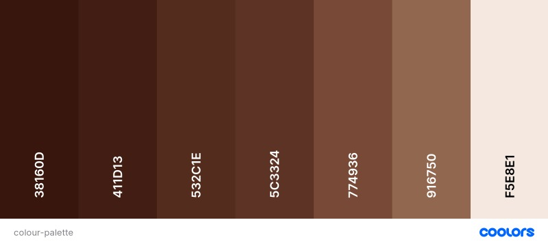
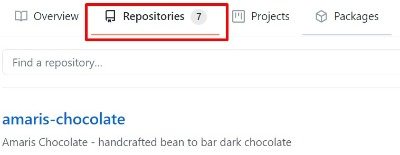

# Amaris Chocolate website                                    

*Developed and designed as part of Milestone Project 1: User Centric Frontend Development module.*

[Please view the live project here](https://fruitbatm.github.io/amaris-chocolate/)

<h2 align="center"></h2>

Above mockup responsive image was created by [Am I responsive](http://ami.responsivedesign.is/).

## Table of Contents
> 1. [Overview](#overview)
> 2. [User Experience (UX)](#user-experience)
>    - [User Stories](#user-stories)
>    - [Visitor Stories](#visitor-stories)
>    - [Business Stories](business-stories)
>    - Structure
>    - Skeleton
>        - [Wireframes](#wireframes)
>    - [Design](#design)
>       - [Colour Scheme](#colour-scheme)
>       - [Fonts](#fonts)
>       - [Imagery](#imagery)
>       - [Icons](#icons)
>       - [Design difference](#design-difference)
> 3. [Features](#features)
>       - [Existing Features](#existing-features)
>       - [Future Implementation](#future-implementation)
> 4. [Technologies](#technologies)
> 5. [Testing](#testing)
> 6. [Deployment](#deployment)
>    - [GitHub pages](#github-pages)
>    - Making a Local Clone
> 7. [Credits](#credits)
>    - [Code](#code)
>    - [Media](#media)
>    - [Content](#content)
> 8. [Acknowledgements](#acknowledgements)
> 9. [Disclaimer](#disclaimer)

# Overview
This is a website for **Amaris Chocolate**, an existing small producer of handcrafted bean to to bar dark chocolates from Croatia.
Their chocolates are made with the high percentage of cocoa parts (70% or more). Bean to Bar chocolate production is a specific method of 
chocolate crafting practiced by chocolate makers that are involved at every stage of the process that the cacao bean goes through.

The main goal of the website is to build and promote **Amaris Chocolate** brand awareness, expand the existing market and to increase the sales.

Amaris Chocolate website was created as a Milestone Project 1 as a part of **Diploma in Full Stack Software Development** with **Code Institute**.
The project is developed primarily using HTML and CSS programs, with a small amount of JavaScript implemented for additional functionality.

# User Experience (UX)
## User Stories
### Visitor Stories
1. As a site visitor, I would like to learn more about the company and what products the company offers. 
2. As a site visitor, I would like to easily navigate through the site and find what I'm looking for with an ease.
3. As a site visitor, I would like to contact the company if I might have any enquires.
4. As a site visitor, I would like to have an option to order the products the company offers.
5. As a site visitor, I would like that the website is responsive on all screen sizes.
6. As a site visitor, I would like to be able to easily find and navigate to the company's social media.

### Business Stories
1. As a business owner, I would like to have the website that is elegant, simple and easy to use.
2. As a business owner, I want the website users to be able to find information about our company and products easily. 
3. As a business owner, I would like to expand our existing market and build the brand awareness.
4. As a business owner, I would like for the users to have an option to order our handcrafted chocolates.
5. As a business owner, I would like to increase the sales.

## Structure
Amaris Chocolate website is designed to be elegant, consistent and user friendly.
    - Interaction Design
    - Information Design

## Skeleton

## Design
### Colour Scheme
- I used three main colours for this project with the main focus on shades of dark brown colour to represent the feel of luxurious organic dark chocolate.
According to the [Color Psychology](https://www.verywellmind.com/color-psychology-2795824) shades of brown (chocolate) evoke the sense of strength, warmth and comfort.
Also, since the dark brown colour is represented in [Amaris Chocolate's](https://fruitbatm.github.io/amaris-chocolate/) logo, the shades of dark brown were emphasized throughout the website. 

- A Caput Mortuum colour (#5C3324) was used for navigation and footer sections. Fot the text, I used Dark Sienna colour (#38160D) and for the headings, Black Bean colour (#411D13).
For the background I used Linen (#F5E8E1) colour which I alternated with the white colour to create defined sections when scrolling through the website. Furthermore, the light background works well with the dark brown text due to its contrast.

- For the buttons I used Coffee (#774936) colour and for the button hover effect I used Liver Chesnut (#916750) in order to indicate the user that the element is clickable and for the better appearance. 
- [Coolors](https://coolors.co/) was used to create a colour palette.

### Fonts
- I used two fonts throughout the project, **Merriweather Sans** and **Merriweather**. Both were used with ``sans-serif`` font as a fallback. 
**Merriweather Sans** was used for the navigation and main headings and **Merriweather** was used for the paragraph sections and footer.

- These fonts are used because of the excellent readability and appearance on screens of all sizes. These fonts were designed to be especially pleasant to read at very small sizes and both harmonize well with one another.

- Both fonts were imported from [Google Fonts](https://fonts.google.com/).

### Imagery
- For the website I used impactful images with chocolate and cocoa beans motives to promote Amaris Chocolate brand & products, to attract the user's attention and to try to influence the need to make a purchase.
All images are sized and compressed for the best user experience.

- I paid attention that the images match the captions and are labeled with keywords important to the website content in order to improve onsite SEO.

- The images were sourced from the below stock photography websites:
    - [Shutterstock](https://www.shutterstock.com/)*
    - [Unsplash](https://unsplash.com/)*
    - [Flickr](https://www.flickr.com/)*
    - Images provided by the company owner*
     
*source and credit for all images used is referenced in the code
### Icons
- I used several icons to improve the website's UX from:
    - [Font Awesome](https://fontawesome.com/)
    - [Flaticon](https://www.flaticon.com/)
                                       
# Features
Amaris Chocolate is built to be fully responsive mobile-first website. This was primarily achieved by utilizing the Bootstrap's grid system.
The website consists of four pages: 'home' (landing), 'our chocolate', 'our story' and 'contact us' page. All website pages have a fixed navbar and footer, with Back to top arrow button ('arrow 2 top') button which allows the user to easily navigate to the top of each page.
Bellow I will describe features in more details.

## Existing Features
- Navigation bar
    - The navigation bar is fixed on top on all website pages and it allows the users to easily navigate throughout the website.
    - It is fully responsive and it collapses to navbar-toggler-icon (hamburger menu) on medium and small devices.
- Responsive
    - By using the mobile-first design, the website is built to be fully responsive. 
- Jumbotron
    - It is used with the background cover image and heading to gain instant user attention. 
- Interactive
    - Text animation added to 'our chocolate' and ' our story' page headers.
    - Drop-down navbar on medium and small devices.
    - Back to top arrow button appears on the lower right of the page when the user start to scroll down a page.
- List of chocolate bars
    - It allows users to learn about the company's products and have an option to order the same via contact form.
- Contact information
    - Contact form allows users to contact the company and make an order by filling the provided form. 
- Footer
    - Allows users to contact the company via email or phone. 
    - Social media icons with links allow users to find more information about the company on social media.
- Accessability
## Future Implementation
- Creating 404 error page
- Contact form processing
- Website version in Croatian language
- Expand chocolate products selection
- Adding the payment methods to order products and collect the payment
- Subscription option

# Technologies
## Languages
- [HTML5](https://en.wikipedia.org/wiki/HTML5) was used as the main language to _complete the structure of the website_.
- [CSS3](https://en.wikipedia.org/wiki/CSS) was used to style the website.
- [JavaScript](https://en.wikipedia.org/wiki/JavaScript) was used to create 'Back To Top Arrow' button functionality

## Frameworks, Libraries and Tools
- [Bootstrap v.4.5.](https://getbootstrap.com/docs/4.5/getting-started/introduction/) was used to create the navbar and contact form as well to make the website responsive.
- [Favicon](https://favicon.io/favicon-converter/) was used to create the favicon for the website.
- [Font Awesome](https://fontawesome.com/) icons were used in footer section for design features and better user experience.
- [Flaticon](https://www.flaticon.com/) was used to download several icons on the website.
- [Google Fonts](https://fonts.google.com/) was used to import the fonts to the website.                             
- [Balsamiq](https://balsamiq.com/) was used to create the wireframes for the website.
- [CSS Tricks](https://css-tricks.com/) was used as a general source.
- [W3School](https://www.w3schools.com/) was used as a general source as well as to create 'Back to Top Arrow' button using JavaScript
- [GitHub](https://github.com/) was used for repository hosting and for storing the source code.
- [Gitpod](https://gitpod.io/) was used as the development environment for writing the code.
- [Git](https://git-scm.com/) was used as version control system to add, commit and push code to GitHub.
- [Adobe Photoshop Express](https://photoshop.adobe.com/) was used for resizing and cropping the images used on the website.
- [Can I Use](https://caniuse.com/) was used as a general resource.
- [TinyJPG](https://tinyjpg.com/) was used for compressing images while preserving transparency.
- [Am I responsive](http://ami.responsivedesign.is/)
- [Techsini](http://techsini.com/multi-mockup/index.php) was used to create the responsive mockup image.
- [Shutterstock](https://www.shutterstock.com/) was used to download the images for the site.
- [Unsplash](https://unsplash.com/) was used to download the images for the site.
- [Flickr](https://www.flickr.com/) was used to download the images for the site.
- [Flaticon](https://www.flaticon.com/) was used to download icons for the site.
- [Animate.css](https://animate.style/) was used as a source for adding CSS animation on headings.
- [Coolors](https://coolors.co/) was used for colour palette used on the website.
- [Google Chrome Developer Tools](https://developers.google.com/web/tools/chrome-devtools)
- [CorelDRAW Graphics Suite 2020](https://www.coreldraw.com/en/product/coreldraw/index-price.html) was used to edit CDR files and convert them to JPG images.

## Validation
- [W3C Markup](https://validator.w3.org/) was used for Markup validation.
- [W3C CSS](https://jigsaw.w3.org/css-validator/) was used for CSS code validation.
- [JavaScript validator](https://www.piliapp.com/javascript-validator/) was used for JavaScript code validation.

# Testing
Please click here for full testing process

# Deployment
## GitHub pages
The project deployment to GitHub Pages is explained in the below steps:
    
1. Login into GitHub, locate and select [Amaris Chocolate](https://github.com/FruitbatM/amaris-chocolate) from the list of Repositories.

    

2. At the top of the Repository page, under the sub-headings, select "Settings" button.

    *Add screenshot

3. Scroll down the page until you reach "GitHub Pages" section.
4. Under the "Source" sub-section, select "master" branch.
5. Click "Save" button.
6. The page will refresh. To locate the link to the published site, scroll down again to the "GitHub Pages" section. Your link will be highlighted in the green box per screenshot below.

    

## Forking GitHub Repository

# Credits
## Code
- [W3School](https://www.w3schools.com/) was used:
    - to create 'Back to Top Arrow' using JavaScript - credit was given in scroll.js file
    - for Badge creation and placement - credit was given in style.css file
    - as a general resource
- [CSS Tricks](https://css-tricks.com/) was used as a general resource.
- [Animate.css](https://animate.style/) was used for CSS animation of heading in 'Our Chocolate' and 'Our Story' pages.
- [Coderwall](https://coderwall.com/) was used for media queries for iPhone 5 - credit was given in style.css file.
## Media
- [Shutterstock](https://www.shutterstock.com/)
- [Unsplash](https://unsplash.com/)
- [Font Awesome](https://fontawesome.com/)
## Content
Below websites were used for a general layout inspiration:
- [HOLY CACAO](https://www.holycacao.co.il/)
- [JOJO's](https://jojoschocolate.com/)
- All content was written by myself

# Acknowledgements
- My mentor, Mr. Spencer Barriball, for the helpful feedback and guidance.
- [Code Institute](https://codeinstitute.net/) for all course materials and ongoing support.
- Fellow Code Institute students for their feedback and suggestions.
- My family and friends for testing and useful feedback. 

# Disclaimer
The information provided on this website is for educational purposes only.
